# Confluent Platform with Apache Flink Minikube Deployment

A Makefile-driven quickstart that deploys a full local streaming stack on Minikube:

- **Confluent Platform** (KRaft mode) via Confluent for Kubernetes (CFK)
- **Apache Flink 2.2** via the Flink Kubernetes Operator
- **Kafka UI** ([Provectus](https://provectus.com/)) for cluster inspection

---

**Table of Contents**
<!-- toc -->
+ [**1.0 Prerequisites**](#10-prerequisites)
+ [**2.0 Resource Requirements**](#20-resource-requirements)
+ [**3.0 Architecture**](#30-architecture)
+ [**4.0 Quickstart**](#40-quickstart)
    - [**3.1 Full stack (CP + Kafka UI)**](#31-full-stack-cp--kafka-ui)
    - [**3.2 Add Apache Flink (run separately after `make up`)**](#32-add-apache-flink-run-separately-after-make-up)
+ [**5.0 Composite Workflow Reference**](#50-composite-workflow-reference)
+ [**6.0 Individual Target Reference**](#60-individual-target-reference)
    - [**6.1 Phase 1 — Prerequisites**](#61-phase-1--prerequisites)
    - [**6.2 Phase 2 — Minikube**](#62-phase-2—-minikube)
    - [**6.3 Phase 3 — Confluent Operator**](#63-phase-3--confluent-operator)
    - [**6.4 Phase 4 — Confluent Platform**](#64-phase-4--confluent-platform)
    - [**6.5 Phase 5 — Control Center**](#65-phase-5--control-center)
    - [**6.6 Phase 6 — Apache Flink**](#66-phase-6-—apache-flink)
    - [**6.7 Phase 7 — Kafka UI (Provectus)**](#67-phase-7--kafka-ui-provectus)
+ [**7.0 Configuration**](#70-configuration)
+ [**8.0 Repository Layout**](#80-repository-layout)
+ [**9.0 Teardown**](#90-teardown)
+ [**10.0 Manual Deployment Instructions**](#100-manual-deployment-instructions)
<!-- tocstop -->

---

## **1.0 Prerequisites**

macOS with Homebrew. To install all required tools in one step:

```bash
make install-prereqs
```

This installs Docker Desktop, `kubectl`, and Minikube via Homebrew. Once complete, **launch Docker Desktop** before proceeding.

To verify all tools are present without installing:

```bash
make check-prereqs
```

Required: `docker`, `kubectl`, `minikube`, `helm`, `envsubst` (`brew install gettext`).

---

## **2.0 Resource Requirements**

Minikube is configured with the following defaults, which are required to run the full stack:

| Resource | Default |
|----------|---------|
| CPUs | 6 |
| Memory | 20 GB |
| Disk | 50 GB |

Override any of these at the command line:

```bash
make up MINIKUBE_CPUS=8 MINIKUBE_MEM=24576
```

---

## **3.0 Architecture**

```mermaid
graph TD
    %% ── Composite entry points ──────────────────────────────────────────
    UP(["`**make up**`"])
    FLINK_UP(["`**make flink-up**`"])
    DOWN(["`**make down**`"])
    FLINK_DOWN(["`**make flink-down**`"])
    TEARDOWN(["`**make teardown**`"])

    %% ── Phase 1: Prerequisites ──────────────────────────────────────────
    subgraph P1["Phase 1 — Prerequisites"]
        CHECK_PRE["check-prereqs\ndocker · kubectl · minikube · helm"]
    end

    %% ── Phase 2: Minikube ───────────────────────────────────────────────
    subgraph P2["Phase 2 — Minikube"]
        MK_START["minikube-start\ncpus=6 · mem=20GB · disk=50GB"]
        MK_STOP["minikube-stop"]
    end

    %% ── Phase 3: Confluent Operator ─────────────────────────────────────
    subgraph P3["Phase 3 — Confluent Operator"]
        NS["namespace\nkubectl create namespace confluent"]
        OP_INSTALL["operator-install\nhelm: confluent-for-kubernetes"]
        OP_UNINSTALL["operator-uninstall"]
    end

    %% ── Phase 4: Confluent Platform ─────────────────────────────────────
    subgraph P4["Phase 4 — Confluent Platform"]
        CP_DEPLOY["cp-deploy\nKafka KRaft · SR · Connect\nksqlDB · REST Proxy · C3"]
        CP_DELETE["cp-delete"]
    end

    %% ── Phase 5: Control Center ─────────────────────────────────────────
    subgraph P5["Phase 5 — Control Center"]
        C3["c3-open\nlocalhost:9021"]
    end

    %% ── Phase 6: Apache Flink ───────────────────────────────────────────
    subgraph P6["Phase 6 — Apache Flink"]
        CERT["flink-cert-manager\ncert-manager v1.17.1"]
        FL_OP["flink-operator-install\nhelm: flink-kubernetes-operator 1.14.0"]
        FL_DEPLOY["flink-deploy\nenvsubst → FlinkDeployment CR\nflink:2.2"]
        FL_UI["flink-ui\nlocalhost:8081"]
        FL_DELETE["flink-delete"]
        FL_OP_UN["flink-operator-uninstall"]
        CERT_UN["cert-manager-uninstall"]
    end

    %% ── Phase 7: Kafka UI ───────────────────────────────────────────────
    subgraph P7["Phase 7 — Kafka UI"]
        KUI_INSTALL["kafka-ui-install\nhelm: provectus/kafka-ui\nbootstrap: kafka:9092"]
        KUI_OPEN["kafka-ui-open\nlocalhost:8080"]
        KUI_UN["kafka-ui-uninstall"]
    end

    %% ── Manifests / Templates ───────────────────────────────────────────
    subgraph FS["k8s/base/"]
        MANIFEST[("flink-basic-deployment.yaml\nFLINK_IMAGE · FLINK_VERSION")]
    end

    %% ── make up dependency chain ────────────────────────────────────────
    UP --> CHECK_PRE
    UP --> MK_START
    UP --> CP_CORE_UP
    UP --> KUI_INSTALL

    CP_CORE_UP["cp-core-up"] --> OP_INSTALL
    CP_CORE_UP --> CP_DEPLOY
    OP_INSTALL --> NS

    %% ── make flink-up dependency chain ──────────────────────────────────
    FLINK_UP --> CERT
    FLINK_UP --> FL_OP
    FLINK_UP --> FL_DEPLOY
    FL_OP --> NS
    FL_DEPLOY --> MANIFEST

    %% ── make down dependency chain ───────────────────────────────────────
    DOWN --> KUI_UN
    DOWN --> CP_DELETE
    DOWN --> OP_UNINSTALL

    %% ── make flink-down dependency chain ─────────────────────────────────
    FLINK_DOWN --> FL_DELETE
    FLINK_DOWN --> FL_OP_UN
    FLINK_DOWN --> CERT_UN

    %% ── make teardown ────────────────────────────────────────────────────
    TEARDOWN -->|"1 — check minikube running"| FLINK_DOWN
    TEARDOWN -->|"2"| DOWN
    TEARDOWN -->|"3 — delete namespace"| NS
    TEARDOWN -->|"4"| MK_STOP

    %% ── UI access ────────────────────────────────────────────────────────
    CP_DEPLOY -.->|"once Running"| C3
    FL_DEPLOY -.->|"once Running"| FL_UI
    KUI_INSTALL -.->|"once Running"| KUI_OPEN

    %% ── Styles ───────────────────────────────────────────────────────────
    classDef entry    fill:#1a1a2e,stroke:#e94560,color:#fff,font-weight:bold
    classDef install  fill:#16213e,stroke:#0f3460,color:#a8dadc
    classDef remove   fill:#2d1b1b,stroke:#8b0000,color:#ffb3b3
    classDef ui       fill:#1b2d1b,stroke:#2d6a2d,color:#b3ffb3
    classDef file     fill:#2d2b1b,stroke:#8b7500,color:#ffe680
    classDef composite fill:#2a1a2e,stroke:#9b59b6,color:#dbb8ff

    class UP,FLINK_UP,DOWN,FLINK_DOWN,TEARDOWN entry
    class CP_CORE_UP composite
    class CHECK_PRE,MK_START,NS,OP_INSTALL,CP_DEPLOY,CERT,FL_OP,FL_DEPLOY,KUI_INSTALL install
    class MK_STOP,OP_UNINSTALL,CP_DELETE,FL_DELETE,FL_OP_UN,CERT_UN,KUI_UN remove
    class C3,FL_UI,KUI_OPEN ui
    class MANIFEST file
```



---

## **4.0 Quickstart**

#### **4.1 Full stack (CP + Kafka UI)**

```bash
make up
```

This runs: `check-prereqs` → `minikube-start` → `namespace` → `operator-install` → `cp-deploy` → `kafka-ui-install`.

Once pods are up, open Control Center:

```bash
make c3-open        # http://localhost:9021
```

### **4.2 Add Apache Flink (run separately after `make up`)**

```bash
make flink-up
```

This runs: `namespace` → `flink-cert-manager` → `flink-operator-install` → `flink-deploy`. `flink-up` is self-contained and can also be run standalone on a fresh cluster.

Once the Flink JobManager pod is running:

```bash
make flink-ui       # http://localhost:8081
```

---

## **5.0 Composite Workflow Reference**

| Target | What it does |
|--------|-------------|
| `make up` | Full stack: Minikube + CP + Kafka UI |
| `make flink-up` | cert-manager + Flink Operator + Flink cluster |
| `make down` | Remove CP, Kafka UI, and Operator (Minikube keeps running) |
| `make flink-down` | Remove Flink cluster, Operator, and cert-manager |
| `make teardown` | Full teardown: everything + stop Minikube |

---

## **6.0 Individual Target Reference**

### **6.1 Phase 1 — Prerequisites**

| Target | Description |
|--------|-------------|
| `install-prereqs` | Install Docker Desktop, kubectl, Minikube via Homebrew |
| `check-prereqs` | Verify all required tools are available |

### **6.2 Phase 2 — Minikube**

| Target | Description |
|--------|-------------|
| `minikube-start` | Start Minikube with configured resources |
| `minikube-status` | Show Minikube and node status |
| `minikube-stop` | Stop the Minikube cluster |
| `minikube-delete` | Permanently delete the Minikube cluster |

### **6.3 Phase 3 — Confluent Operator**

| Target | Description |
|--------|-------------|
| `namespace` | Create the `confluent` namespace and set it as default context |
| `operator-install` | Add Confluent Helm repo and install CFK Operator |
| `operator-status` | Show CFK Operator pod status |
| `operator-uninstall` | Remove the CFK Operator Helm release |

### **6.4 Phase 4 — Confluent Platform**

| Target | Description |
|--------|-------------|
| `cp-deploy` | Deploy Kafka (KRaft), Schema Registry, Connect, ksqlDB, REST Proxy, Control Center |
| `cp-watch` | Watch pod startup live (Ctrl+C to exit) |
| `cp-status` | Show current pod status |
| `cp-delete` | Remove all CP components |

### **6.5 Phase 5 — Control Center**

| Target | Description |
|--------|-------------|
| `c3-open` | Port-forward Control Center and open `http://localhost:9021` |

### **6.6 Phase 6 — Apache Flink**

| Target | Description |
|--------|-------------|
| `flink-cert-manager` | Install cert-manager (Flink Operator dependency) |
| `flink-operator-install` | Install the Flink Kubernetes Operator |
| `flink-operator-status` | Show Flink Operator pod status |
| `flink-operator-uninstall` | Remove the Flink Operator Helm release |
| `flink-deploy` | Deploy the Flink session cluster |
| `flink-status` | Show Flink pods and FlinkDeployment CRs |
| `flink-ui` | Port-forward Flink UI and open `http://localhost:8081` |
| `flink-delete` | Delete the Flink session cluster |
| `cert-manager-uninstall` | Remove cert-manager |

### **6.7 Phase 7 — Kafka UI (Provectus)**

| Target | Description |
|--------|-------------|
| `kafka-ui-install` | Install Kafka UI connected to the local CP cluster |
| `kafka-ui-status` | Show Kafka UI pod status |
| `kafka-ui-open` | Port-forward Kafka UI and open `http://localhost:8080` |
| `kafka-ui-uninstall` | Remove Kafka UI |

---

## **7.0 Configuration**

All variables are overridable at the command line. Defaults:

| Variable | Default | Description |
|----------|---------|-------------|
| `NAMESPACE` | `confluent` | Kubernetes namespace |
| `MINIKUBE_CPUS` | `6` | vCPUs allocated to Minikube |
| `MINIKUBE_MEM` | `20480` | Memory in MB |
| `MINIKUBE_DISK` | `50g` | Disk size |
| `FLINK_OPERATOR_VER` | `1.14.0` | Flink Kubernetes Operator version |
| `FLINK_IMAGE` | `flink:2.2` | Flink container image |
| `FLINK_VERSION` | `v2_2` | Flink API version string for the FlinkDeployment CR |
| `FLINK_CLUSTER_NAME` | `flink-basic` | Name of the FlinkDeployment resource |
| `FLINK_MANIFEST` | `k8s/base/flink-basic-deployment.yaml` | Path to FlinkDeployment template |
| `CERT_MANAGER_VER` | `v1.17.1` | cert-manager version |
| `C3_PORT` | `9021` | Control Center local port |
| `FLINK_UI_PORT` | `8081` | Flink UI local port |
| `KAFKA_UI_PORT` | `8080` | Kafka UI local port |

Example — deploy Flink 2.1 instead of 2.2:

```bash
make flink-deploy FLINK_IMAGE=flink:2.1 FLINK_VERSION=v2_1
```

---

## **8.0 Repository Layout**

```
.
├── Makefile
├── README.md
├── README.pdf
├── CHANGELOG.md
├── CHANGELOG.pdf
├── KNOWN_ISSUES.md
├── KNOWN_ISSUES.pdf
├── LICENSE.md
├── LICENSE.pdf
├── .gitignore
├── docs
│   ├── manual_deployment.md            # Step-by-step manual deployment instructions (without Makefile)
│   └── manual_deployment.pdf  
└── k8s/
    └── base/
        └── flink-basic-deployment.yaml # FlinkDeployment CR template
```

> The `flink-basic-deployment.yaml` is a template, `FLINK_IMAGE` and `FLINK_VERSION` are substituted at deploy time via `envsubst`. Do not apply it directly with `kubectl apply`.

---

## **9.0 Teardown**

Remove everything and stop Minikube:

```bash
make teardown
```

To keep Minikube running but remove all deployed components:

```bash
make flink-down   # Flink cluster + operator + cert-manager
make down         # CP + Kafka UI + CFK Operator
```

## **10.0 Manual Deployment Instructions**
For users who want to understand the underlying steps without using the Makefile, see [docs/manual_deployment.md](docs/manual_deployment.md).